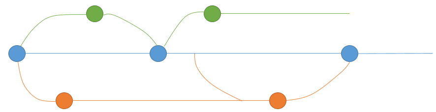

## Github

Version control system, collaboration, software development.

Uses git in the background to enable version control.

Can have private or public repositories.

Really good for developing R packages 

* stable version on CRAN, development version 
* integrates with continuous integration (CI)
  * circleCI
  * travis-ci
  * appveyor
  * continuous integration rebuilds your package with each push
    * you know when something breaks
    * runs all of your tests
    * not exactly the same as the tests CRAN run, but better than nothing
    * [secuTrialR uses this](https://github.com/SwissClinicalTrialOrganisation/secuTrialR/pull/153)
* can install packages directly from github via `remotes::install_github` (also from bitbucket and others)
* really good for collaborating
  * each user/developer
    * forks the main repository
    * 
    * develops their parts in isolation
    * pushes the developments back to the master (more later)
    * 
    * can also pull more recent changes
  * 
* package website based on readme, helpfiles and vignettes 
  * [presize](https://ctu-bern.github.io/presize/) 
  * [ggplot2](https://ggplot2.tidyverse.org/))
  
Could also use it as a repository for the code behind a paper, although something more static more be more suitable (e.g. zenodo?), as you can change things on github.

Also useful for saving chunks of code that might be useful again (like a dropbox). 

Doesnt have to be R code, could be anything.
  
### What I do
1. fork/create a repo online
2. use cmd to clone it to my local machine using cmd
  * 
  * 
3. create a new branch (easiest within RStudio)
  * 
  * if you're connected to the internet, the branch will automatically by pushed to github
  * you can have as many branches as you want
    * need to take a little bit of care - 
4. make my changes (via RStudio)
  * open files, add functionality/fix bugs/whatever
5. commit the changes (via RStudio)
6. push the changes to github (via RStudio)
  * if using CI, any the appropriate app has permissions for your fork, CI will run now. If only the master has CI enabled, it'll run when you make a pull request.
7. working with others?
  * yes! Have other pull requests been made?
    * yes! -> pull the current master, clear any conflicts
      * set up a remote to the master and pull using cmd - 
        * e.g. 
        * git remote add "ctu" "https://github.com/CTU-Bern/presize.git"
        * git pull ctu
      * you can do all sorts of stuff via remotes (see the remotes section of Happy git with R)
    * no! happy days, continue
8. happy?
  * yes! -> Make a pull request (on github)
  * no :( -> Make more changes and reiterate steps 7 and 8 until happy.

### Where to get help and resources
git is very common. There are alot of people out there that have asked questions already so google is your friend! Most of the time it has an answer.

[Happy git with R](https://happygitwithr.com/) covers just about everything you would want to know.

[Atlassian](https://www.atlassian.com/git/tutorials/what-is-git) are folk behind bitbucket and have a some very good descriptions.

